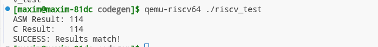

# RISC-V Codegen Project: Functional Array Processor

Данный проект содержит реализацию функции обработки массива на языке ассемблера RISC-V, интегрированную с тестовым стендом на языке Си.

Инструкция по сборке и запуску

Предполагается, что вы используете ОС Manjaro/Arch Linux.

## 1. Установка зависимостей

Для кросс-компиляции и эмуляции выполните:

```bash
sudo pacman -S riscv64-linux-gnu-gcc riscv64-linux-gnu-binutils qemu-user-static
```

## 2. Сборка проекта

Используется статическая линковка, чтобы исключить зависимости от системных библиотек RISC-V:

```bash
riscv64-linux-gnu-gcc -static main.c func.s -o riscv_test
```

## 3. Запуск

Запуск осуществляется через эмулятор пользовательского уровня QEMU:

```bash
qemu-riscv64 ./riscv_test
```

## Пояснение: Переход на временные регистры (t0-t6)

Первоначальная версия кода использовала сохраняемые регистры (s0, s1). В итоговой реализации мы перешли на временные регистры (t4, t5). Вот почему это было сделано:

### 1. Соблюдение RISC-V ABI (Calling Convention)

Согласно стандарту RISC-V ABI:

- Регистры s0-s11 (Callee-saved): Если функция использует эти регистры, она обязана сохранить их старые значения в стек и восстановить перед выходом.

- Регистры t0-t6 (Caller-saved): Это «черновики». Функция может использовать их свободно, не заботясь о сохранении.

### 2. Причина возникновения Segmentation Fault

В предыдущих итерациях использование s0 (который в RISC-V часто зарезервирован как Frame Pointer) приводило к конфликтам с механизмом управления стеком в gcc. Даже небольшая ошибка в выравнивании стека (sp) или порядке sw/lw приводила к тому, что адрес возврата (ra) портился, и программа пыталась прыгнуть по некорректному адресу памяти.

### 3. Оптимизация

Использование t-регистров позволило:

- Упростить код: Мы убрали лишние операции записи/чтения из памяти (sw/lw) для каждого регистра.

- Повысить надежность: Мы минимизировали работу со стеком, оставив только сохранение адреса возврата ra. Это сделало функцию «легковесной» и устойчивой к ошибкам окружения.

## Результаты тестирования

Программа сравнивает результат работы ассемблерной функции с эталонной функцией на Си.

- Входные данные: {10, 20, 30, 40, 50}, n=5.

- Ожидаемый результат: 114.

